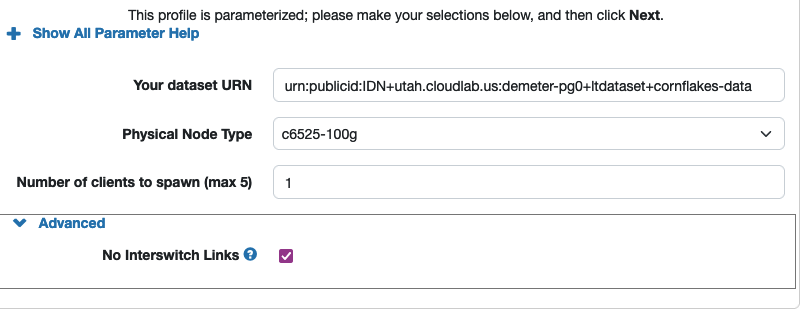
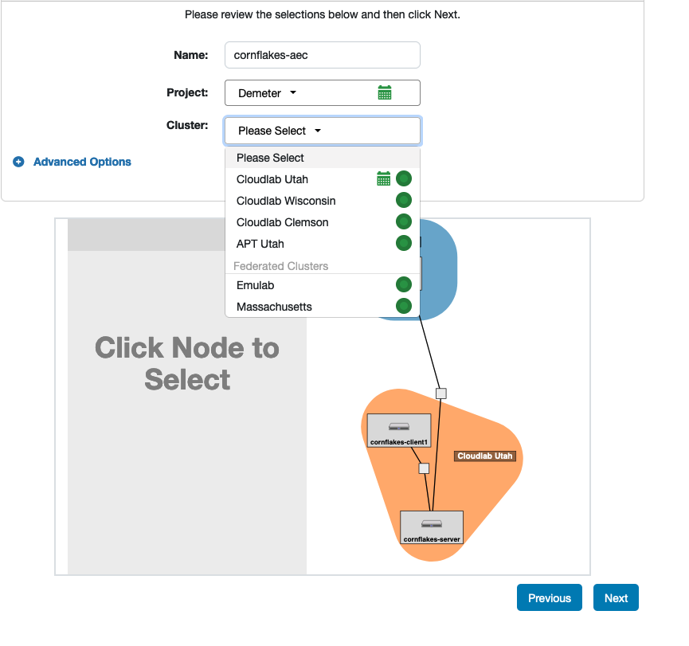
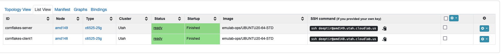
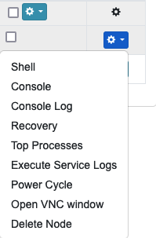
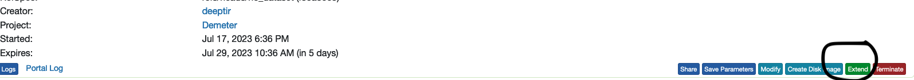
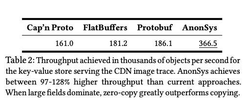

# cornflakes-scripts
This repository contains scripts to run and reproduce results from the SOSP paper,
Cornflakes: Zero-Copy Serialization for Microsecond-Scale Networking,
conditionally accepted at SOSP 2023, on Cloudlab.
The scripts in this repository assume you have setup machines
via the custom cloudlab-profile linked below; this profile 
sets up Cloudlab machines with all the necessary dependencies.
The scripts in this repo assume certain filepaths (i.e., cornflakes is located at
/mydata/$USER/cornflakes) which the cloudlab profile sets up automatically; if
you manually clone cornflakes into a different path, you must change the paths
in these scripts.
The traces used in the evaluation are located in a Cloudlab
long-term dataset; the cloudlab profile mounts the traces on one machine and the
setup scripts scp the traces to all machines on startup.
The main Cornflakes repo contains
instructions for how to get started with Cornflakes on your own hardware; this
repo is intended for reproducing the main results.
Here is an overview of the steps that lead to reproduction along with expected
time; note you'll need access to a cloudlab account to go through these steps.
Any instructions that say wait indicate you can leave it running and come back
later.
| Step | Expected Time |
| ----------------------------------- | -------------------------------------------- |
| Instantiate cloudlab cluster via cloudlab profile (active). | 4-5 minutes |
| Let machines to instantiate and run install scripts (leave and come back). | 1 hour or so of waiting. |
| Reboot each machine after installation scripts have finished running (active). | 2-3 minutes |
| Clone repos to each machine, run post-reboot configuration steps, generate cluster configuration files (active). | 5-10 minutes |
| Run hello-world example to test setup works properly (active). | 5-10 minutes |
| Replicate Figure 8 (start, and come back). | 2-3 minutes active, 4-5 hours of waiting. |
| Replicate Figures 7 and 12 (start, and come back). | 2-3 minutes active, 14-15 hours of waiting (but good to [check](#failed-to-ssh) once halfway through). |
| Replicate Figure 5 partially (start, and come back). | 2-3 minutes active, ~23 hours of waiting (but good to [check](#failed-to-ssh) once or twice through). |
| (Optional) Replicate Figure 6 (start, and come back). | 2-3 minutes active, 3 hours of waiting. |
| (Optional) Replicate Table 2 (start, and come back). | 2-3 minutes active, 2 hours of waiting. |


# Code version and structure
This repository assumes [cornflakes](httpconda install cudatoolkits://github.com/deeptir18/cornflakes), on the main branch, at `755edc3` commit hash,
and the cloudlab profile pointing to [this repository](https://github.com/deeptir18/cornflakes-cloudlab-profile) at main and `cbe4266` commit hash.
We briefly describe the code structure of Cornflakes below.
```
cornflakes
    - cf-kv:  source code for kv store application
    - redis: redis submodule with changes to redis
    - cornflakes-codegen: boilerplate for generating Rust serialization code
    - cornflakes-libos: common serialization and datapath interface code
    - cornflakes-utils: common utilities for running binaries
    - mlx5-datapath: custom datapath built on Mellanox OFED drivers.
    - ice-datapath: custom datapath built on Intel Ice drivers.
    - dpdk-datapath: interface to datapath over DPDK (mainly used for client
      load generators).
```

# Cloudlab profile instructions (1 hour machine time, 15-20 minutes human time)
We have provided a [cloudlab profile](https://www.cloudlab.us/p/955539a31b0c7be330933414edd8d4af54f7dbec) that automaticaly installs and configures
most of what is needed to run Cornflakes (there is some configuration that must
be done once the install scripts finish).
## Dataset
The cloudlab dataset is at
`urn:publicid:IDN+utah.cloudlab.us:demeter-pg0+ltdataset+cornflakes-data`; this
is in the Utah cluster; the default argument in the Cloudlab profile points to
this dataset.
## Hardware
To run the evaluation, you MUST use a cluster with either d6515, or c6525-100g, or c6525-25g
nodes in the Cloudlab Utah cluster (the dataset containing the traces is located
on the Utah cluster); we highly recommend c6525-100g, then d6515, and then c6525-25g.
Our evaluation in the paper used c6525-100g machines (but the instructions should work on all
three machine types).
If you use
c6525-25g machines (due to 100g machines not being available) you may see different results (lower raw throughputs), because the network bandwidth
is lower, for the reproduction of Figure 5, where the copy-zero-copy
tradeoff may change.

## Profile
The cloudlab profile is located [here](https://www.cloudlab.us/p/955539a31b0c7be330933414edd8d4af54f7dbec). Please instantiate the profile with the latest `main` default branch. Steps 0-4 should take a couple minutes; Step 5 takes about 1 hour for all the dependencies to install; Step 6 takes another couple minutes to power cycle the machines again.

To use the profile:

0. Press "next."

1. Choose values for parameters: the dataset value already points to the dataset
   described above; choose the machine type; and choose the number of clients.
All results below just require 1 client. Please click the dropdown for
`advanced` and click the checkbox next to `No Interswitch Links` (this ensures
there is only one switch between the client and server machine). A screenshot
using the c6525-100g machines, and 1 client is shown below:


2. On the next page, enter a name for the experiment, and select `Cloudlab Utah`
   in the dropdown menu.


3. Press next; the next page indicates if you would like to schedule the
   experiment for later; you can skip and press "Finish" to instantiate
immediately.

4. Wait for 2-3 minutes to ensure the machines are allocated (it helps to have a
   reservation, as 100g machines are more in demand) and the profile has
worked successfully.

5. The install scripts take about 1 hour to run; they install many libraries
   from scratch. **Let this run for about 1 hour**, until the `Startup` column on the
   experiment page indicates the startup is finished. It will look something
   like the following; note one machine is `cornflakes-server` machine and the
   rest are `cornflakes-clientx`.


6. After the cloudlab UI indicates that the startup scripts have _finished_
   running, please reboot (power cycle) each of the machines (by clicking according to the screenshot below). This loads the newly installed
Mellanox drivers. Once the cloudlab UI indicates the machines are rebooted
(`Status` column says `Ready`), you
are ready to use them for experiments!


7. The results we recommend reproducing take around 5, 14, and 20 hours each to
   run. Therefore, we recommend that you extend the cloudlab experiment for a
few days to finish the artifact evaluation (press extend on the experiment
status page); experiments automatically get
deleted after 16 hours if you're not careful. The following screenshot shows
where the extend button is.



## Build cornflakes and configuring the machine post-reboot settings (about 5-10 minutes)
0. Clone and build cornflakes (5-7 minutes).

After the cloudlab UI indicates the machines have rebooted, please log into each of the server and client nodes and run the
following (on all nodes); this builds Cornflakes and the relevant kv-store
and redis applications within Cornflakes. Note that `$USER` refers to your cloudlab username.
```
## clone and build cornflakes
/local/repository/clone_cornflakes.sh
```
After this, on all machines, you will see the following repos at the following
locations:
| Repo | Location |
| --- | ----------- |
| cornflakes | `/mydata/$USER/cornflakes` |
| cornflakes-scripts | `/mydata/$USER/cornflakes-scripts` |
| cornflakes-cloudlab-profile | `/local/repository` |

1. Machine settings. On each machine, log in and run the following:
```
## installs hugetlbfs, required for zero-copy
sudo /local/repository/install-hugepages.sh 7500
## disables c-states
sudo /local/repository/set_freq.sh
## increase number of open file descriptors
/local/repository/ulimit.sh
```

2. Configure config file on each machine (1 min).
To run any cornflakes experiments, Cornflakes requires a config file that
   looks like [sample config](sample_config.yaml). The following python script
automatically fills in the config file; please do not change the `--outfile`
argument of the python script, where the experiment bash scripts expect the
config file will be located. The script also ensures jumbo frames are
turned on for the correct interface. The following table describes the environment
variables:

| Variables | Definition |
| ---------------- | ------------------------------------------------------------ |
| `$NUM_CLIENTS` | Number of clients configured in cloudlab profile (e.g., machines named `cornflakes-clientx`) |

**Note**: If you are using d6515 machines, please ssh into one of the machines
and check the interface name of the ssh interface (e.g., the interface listed by
`ifconfig` that contains the SSH IP for the machine, which will likely be 128.xxx.xxx.xx). `generate-config.py`
hardcodes the variable `SSH_IP_INTERFACE` near the top of the file to the
interface name used by c6525-100g or 25g machines for the SSH interface; for
d6515 machines, please change this. You need to change the variable on all
client and server machines.


```
export NUM_CLIENTS=x
mkdir -p /mydata/$USER/config && python3 /local/repository/generate-config.py --user $USER --num_clients $NUM_CLIENTS --outfile /mydata/$USER/config/cluster_config.yaml
```
The output of generate-config.py should look like so:
```
192.168.1.1 cornflakes-server
XXX.XXX.XXX.XX
192.168.1.2 cornflakes-client1
XXX.XXX.XXX.XX
==> [cornflakes-server: XXX.XXX.XXX.XX] setup ssh connection
==> [cornflakes-client1: XXX.XXX.XXX.XX] setup ssh connection
  -> [XXX.XXX.XXX.XX]       bash -c "ifconfig | grep -B1 \"192.168.1.1\" | awk '{print $first}'"
  -> [XXX.XXX.XXX.XX]       bash -c "ifconfig ens1f1np1 | grep 'ether'"
  -> [XXX.XXX.XXX.XX]       bash -c "ethtool -i ens1f1np1 | grep 'bus-info'"
==> [cornflakes-server: ('192.168.1.1', 'cornflakes-server')] interface: ens1f1np1, mac: XX:XX:XX:XX:XX, pci: 0000:41:00.1, port: 1
  -> [XXX.XXX.XXX.XX]       bash -c "ifconfig | grep -B1 \"192.168.1.2\" | awk '{print $first}'"
  -> [XXX.XXX.XXX.XX]       bash -c "ifconfig ens1f0np0 | grep 'ether'"
  -> [XXX.XXX.XXX.XX]       bash -c "ethtool -i ens1f0np0 | grep 'bus-info'"
==> [cornflakes-client1: ('192.168.1.2', 'cornflakes-client1')] interface: ens1f0np0, mac: XX:XX:XX:XX:XX, pci: 0000:41:00.0, port: 0
```
**Checking the output**: To check if the command ran successfully, check the file at
`/mydata/$USER/config/cluster_config.yaml`; particularly ensure the entry at
`dpdk` and `mlx5` are non-empty and look like [sample config](sample_config.yaml).


3. Turn on jumbo frames for the relevant experiment interface on all machines (1 min) IF
   they are not already turned on.

Note from the output of the `generate-config.py` step above, the output that
looks like the following. This is saying the IP address, mac address, pci address and
interface name for the experiment interface on each machine.
```
==> [cornflakes-server: ('192.168.1.1', 'cornflakes-server')] interface: ens1f1np1, mac: XX:XX:XX:XX:XX, pci: 0000:41:00.1, port: 1
==> [cornflakes-client1: ('192.168.1.2', 'cornflakes-client1')] interface: ens1f0np0, mac: XX:XX:XX:XX:XX, pci: 0000:41:00.0, port: 0
```

On all machines, use the interface name (`$INTERFACE` in the command below) (e.g.,
`ens1f1np1` for cornflakes-server and `ens1f0np0` for the cornflakes-client) from
the output above, to check for jumbo frames:

```
# for each machine
ssh $USER@machine
## CHECK FOR jumbo frames
export INTERFACE=<interface> # name printed out by generate-config.py for that machine
ifconfig $INTERFACE | grep -o 'mtu [0-9]*'
```
If they are turned on, you will see something like:

```
mtu 9000
```
If jumbo frames are not turned on:
```
# for each machine
ssh $USER@machine
export INTERFACE=<interface> # name printed out by generate-config.py for that machine
sudo ip link set dev $INTERFACE mtu 9000
```

4. Check ping-ability from client to server machines and vice versa. If this is
   not working, please power cycle the machines again and before doing anything
   else, ensure this works.
```
ssh $USER@cornflakes-server-IP
ping 192.168.1.2 # ctrl-c if works
## you have more than 1 client
ping 192.168.1.3
## ... and so on.
```

5. If at any point you need to power cycles or reboot the nodes, please rerun
   step 1 (configuring the machine post reboot) and the jumbo frames command if
   necessary, as well as any steps you have not done (generate config file,
   clone cornflakes). If you power cycle and are using d6515 machines, and need to-regenerate the config
   file, you need to change the SSH_INTERFACE_NAME variable in `/local/repository/generate-config.py` as mentioned in step 2 (as the scripts in `/local/repository/` reset).

# Results reproduced overview
## Main results reproduced
We have provided instructions to reproduce Figure 8, Figure 7, Figure 12, and
part of Figure 5.
Figure 8 (Redis integration with the twitter trace) and Figure 7 (comparison to
existing libraries on the twitter trace) show Cornflakes provides gains compared
to existing software serialization approaches. Figure 12 shows that the hybrid approach offers some gain.
The portion of Figure 5 validates our current threshold choice of 512; the full
heatmap takes days to run (but we provide instructions for that as well).

## Optional results 
We have also provided scripts to run the experiments described in Table 2 (CDN
workload), and Figure 6 (the google workload), but we believe the results listed
above constitute the core results of the paper.

## How results work
For each figure, we have provided a bash script that invokes the python script
necessary to run the experiment described, which hardcodes locations of
cornflakes and the config files to what the cloudlab profile setup. The form of the bash script is
roughly the following (the trace related arguments depends on the specific
experiment).
```
python3 $PATH_TO_CORNFLAKES/experiments/xx-bench.py -e loop \
    -f $PATH_TO_RESULTS \
    -c $PATH_TO_CLUSTER_CONFIG \
    -ec $PATH_TO_CORNFLAKES/path_to_command_line_yaml \
    -lc $PATH_TO_EXPERIMENT_LOOP \
    --trace <trace_file>
```
Here is information about each parameter. We briefly describe what changing each
would do:
- `$PATH_TO_CLUSTER_CONFIG`: changes the location to the machine's cluster
  config.
- `$PATH_TO_RESULTS`: changes where the expected results for the experiment end
  up.
- `$PATH_TO_CORNFLAKES`: where the cornflakes repo is located.
- `-ec` argument: Each program has a yaml that specifies the command line (for both the server and client) specified by the `-ec` argument that shows how the binary is run. This should not be changed; it is hardcoded to a location inside the cornflakes repo.
- `-lc` argument: This specifies the parameters that will be looped over for the
  particular experiment (e.g., the exact parameters to load the experiment, and
exact rates to use in the throughput latency curve). Changing this changes the
parameters the experiment will run over.

## Issues / things to watch out for
### Expected time estimates in script output is wrong
The python scripts themselves print out the number of trials that will be run,
current percentage done, and expected time.
The "expected time" estimate is likely slightly wrong (instead, see the times we
list along with each experiment), especially if you restart
the experiment in the middle and it picks up again midway through.
These estimates were used while developing to schedule/plan out experiments
better.

### Failed to ssh
For the longer running experiments (more than a few hours), the python scripts sometimes fail to ssh and stop running.
**Restarting the scripts (taking care to kill any process if you
[ctrl-c](#ctrl-c-in-the-middle-of-the-script) and the script hadn't already
died) will let the scripts continue on.*** This is why we recommend checking the
progress of the longer (15-20 hour experiments a couple of times through).
The following snippets show two SSH errors we've encountered with the longer
running scripts; merely rerunning the scripts (taking care to kill any process
if [you ctrl-c](# Ctrl-c-in-the-middle-of-the-script) lets you continue.
One issue has two do with not
being able to open file descriptors; the other has to do with a socket being
closed.
1. OS socket closed:
```
Saw 1 exceptions within threads (OSError):
Thread args: {'kwargs': {'echo': None,
            'input_': <_io.TextIOWrapper name='<stdin>' mode='r' encoding='utf-8'>,
            'output': <_io.TextIOWrapper name='<stdout>' mode='w' encoding='utf-8'>},
 'target': <bound method Runner.handle_stdin of <fabric.runners.Remote object at 0x7f9a66688be0>>}
Traceback (most recent call last):
  File "/users/USER/.local/lib/python3.8/site-packages/invoke/util.py", line 237, in run
    super(ExceptionHandlingThread, self).run()
  File "/usr/lib/python3.8/threading.py", line 870, in run
    self._target(*self._args, **self._kwargs)
  File "/users/USER/.local/lib/python3.8/site-packages/invoke/runners.py", line 852, in handle_stdin
    self.write_proc_stdin(data)
  File "/users/USER/.local/lib/python3.8/site-packages/invoke/runners.py", line 990, in write_proc_stdin
    self._write_proc_stdin(data.encode(self.encoding))
  File "/users/USER/.local/lib/python3.8/site-packages/fabric/runners.py", line 67, in _write_proc_stdin
    return self.channel.sendall(data)
  File "/users/USER/.local/lib/python3.8/site-packages/paramiko/channel.py", line 844, in sendall
    sent = self.send(s)
  File "/users/USER/.local/lib/python3.8/site-packages/paramiko/channel.py", line 799, in send
    return self._send(s, m)
  File "/users/USER/.local/lib/python3.8/site-packages/paramiko/channel.py", line 1196, in _send
    raise socket.error("Socket is closed")
OSError: Socket is closed
```
2. SSH failed due to not being able to open file descriptors:
```
 → [DEBUG]:   XXX.XXX.XXX.XX USER 22 None
 → [WARN]:   Failed to ssh with host XXX.XXX.XXX.XX, user USER, port 22, key None, err: [Errno 24] Too many open files: '/users/USER/.ssh/id_rsa'
 → [DEBUG]:   XXX.XXX.XXX.XX USER 22 None
 → [WARN]:   Failed to ssh with host XXX.XXX.XXX.XX, user USER, port 22, key None, err: [Errno 24] Too many open files: '/etc/invoke.yaml'
```

### Ctrl-c in the middle of the script
If you ctrl-c while an experiment script runs, the script may not gracefully
kill the server or client binaries.
Please run the following before running the binaries again (note that you may not
need to run all commands; it depends on which experiment you were running).
```
# on the server
sudo pkill -9 redis-server 
sudo pkill -9 twitter_mlx5
sudo pkill -9 googleproto_mlx5
sudo pkill -9 cdn_mlx5
sudo pkill -9 ycsb_mlx5
# on the client
sudo pkill -9 ycsb_dpdk
sudo pkill -9 cdn_dpdk
sudo pkill -9 twitter_dpdk
sudo pkill -9 googleproto_dpdk
```

# Hello world example (~2-3 minutes)
### Instructions
```
ssh $USER@cornflakes-server-IP
cd /mydata/$USER/cornflakes-scripts/
./helloworld.sh
```

### Experiment output
The script runs two trials from the heatmap (Figure 5) experiments.
The experiment output will indicate 2 iterations (e.g. `Running Iteration 1 out
of 2...`) and print out command lines that run on each client. After running the
2 iterations, some graphing errors or warnings will likely be printed, such as:
```
Error in `combine_vars()`:
! Faceting variables must have at least one value
Backtrace:
```

Feel free to ignore any of these graphing related errors (the graphing scripts expect more than 2 points, hence
the errors). 
To confirm the experiment worked correctly, the file `/mydata/$USER/expdata/helloworld/latencies.log`
should contain a csv header and two csv lines, indicating the two trials ran.
Running this successfully indicates ssh access between the machines work, the kv binaries are compiled, the experiment trace data is at the right location, and the client and server can send packets to each other.
The [sample hello world output](helloworld.log) has an example of some of the standard output that will be printed.
```
ssh $USER@cornflakes-server-IP
## should be a csv containing a header and two lines
cat /mydata/$USER/expdata/helloworld/latencies.log
```

# Reproducing results.
## Figure 8 (Redis comparison over twitter traces)
### Experiment time overview (5-6 hours compute, 2-3 min human).
This script takes about 5-6 hours to run. It runs two throughput latency curves
(Cornflakes serialization and Redis serialization inside Redis) of 39 points
each; each point runs for about 30 seconds; however, the server loads the values
into memory for each point causing each trial to take closer to two minutes.

### Instructions (after ssh'ing, run actual script in tmux or screen)
```
## ssh into the server node on cloudlab
ssh $USER@cornflakes-server-IP
## run inside tmux or screen
cd /mydata/$USER/cornflakes-scripts
./twitter-traces-redis.sh
```

### Initial expected outputs (wait ~5 minutes)
Something like the output in the [fig 8 sample log](fig8output.log)
should print after 5 or so minutes (the first trial will have run).


### Expected output location
| Figure | Filepath |
| --- | ----------- |
| Figure 8 |`/mydata/$USER/expdata/twitter_redis/plots/min_num_keys_4000000/value_size_0/ignore_sets_False/ignore_pps_True/distribution_exponential/baselines_p99_cr.pdf` |

To see a median latency graph, replace `p99` with `median` in any of the graph
paths (these were not reported in the paper).

### Expected Figures (from paper)


## Figure 7 and 12 (Cornflakes KV, running twitter trace.)
### Experiment Time (14-15 hours compute, 2-3 min human time)
This script takes around 14-15 hours to run (ignore the time estimate
immediately printed by the script).
It runs 6 throughput latency curves (Protobuf, Flatbuffers, Capnproto,
Cornflakes, and Cornflakes configured to only copy or only zero-copy); each
curve consists of about 40 throughput latency points and produces both the
baselines comparison results and hybrid comparison result.

### Instructions (after ssh'ing, run actual script in tmux or screen)

```
ssh $USER@cornflakes-server-IP
## run inside tmux or screen
cd /mydata/$USER/cornflakes-scripts
./twitter-traces-cfkv.sh
```

### Initial expected outputs (wait ~5 minutes)
Something like the output in the [fig 7 and 12 sample log](fig7and12output.log)
should print after 5 or so minutes (the first trial will have run).

### Expected output location
| Figure | Filepath |
| --- | ----------- |
| Figure 7 (comparing baselines) |`/mydata/$USER/expdata/twitter_cfkv/plots/min_num_keys_4000000/value_size_0/ignore_sets_False/ignore_pps_True/distribution_exponential/baselines_p99_cr.pdf` |
| Figure 12 (hybrid comparison) |`/mydata/$USER/expdata/twitter_cfkv/plots/min_num_keys_4000000/value_size_0/ignore_sets_False/ignore_pps_True/distribution_exponential/thresholdvary_p99_cr.pdf` |

To see median latency graphs, replace `p99` with `median` in any of the graph
paths (these were not reported in the paper).

### Expected Figures (from paper)


## Figure 5 Partial (threshold heatmap)
### Experiment Time (23-24 hours compute, 2-3 min human time)
This script takes almost a full day. It runs the datapoints required to compute
the `1024` and `2048` vertical columns of the heatmap in Figure 5 and validates
the threshold choice of 512; all vertical
columns would take a few more days.

### Instructions (after ssh'ing, run actual script in tmux or screen)

```
ssh $USER@cornflakes-server-IP
## run inside tmux or screen
cd /mydata/$USER/cornflakes-scripts
./mmtstudy.sh
```

### Initial expected outputs (wait ~5 minutes)
Something like the output in the [fig 5 sample log](fig5output.log)
should print after 5 or so minutes (the first trial will have run).


### Expected output location
| Figure | Filepath |
| --- | ----------- |
| Figure 5 subset|`/mydata/$USER/expdata/threshold_heatmap/plots/heatmap_anon.pdf` |

### Expected Figure (from paper)
You should see the two vertical columns of 1024 and 2047 from:


### Running the entire Figure 5 (optional)
If you are interested in recreating the entire Figure 5, modify `mmtstudy.sh`
so the `-lc` argument takes in `-lc /mydata/$GENIUSER/cornflakes-scripts/yamls/fig5.yaml`;
this yaml specifies the iterations for recreating the entire heatmap.

## Figure 6 (custom kv store with google trace, optional)
### Experiment Time (3 hours compute, 2-3 min human time)
This experiment runs the custom kv store with the google trace on the software
baselines; it just does the version where the values are lists of 1-8 elements.

### Instructions (after ssh'ing, run actual script in tmux or screen)
```
ssh $USER@cornflakes-server-ip
## run inside tmux or screen
cd /mydata/$user/cornflakes-scripts
./google-traces.sh
```

### Expected output location
| Figure | Filepath |
| --- | ----------- |
| Figure 6 |`/mydata/$USER/expdata/googleproto_cfkv/plots/max_num_values_8/total_num_keys_1000000/key_size_64/distribution_exponential/baselines_p99_cr.pdf`|

### Expected Figure (from paper)


## Table 2 (CDN trace, optional)
### Experiment Time (3 hours compute, 2-3 min human time)

### Instructions (after ssh'ing, run actual script in tmux or screen)
```
ssh $USER@cornflakes-server-IP
## run inside tmux or screen
cd /mydata/$USER/cornflakes-scripts
./cdn-traces.sh
```

### Expected output location
The python script calculates the highest achieved load across all offered loads
for each system; you can use the `format-cdn.sh` bash script in the
`cornflakes-scripts` repo to format the log.
| Figure | Filepath | Format Command |
| --- | ----------- | -------------- |
 Table 2 | `/mydata/$USER/expdata/cdn_cfkv/latencies-postprocess.log` | `/mydata/$USER/cornflakes-scripts/format-cdn.sh /mydata/$USER/expdata/cdn_cfkv/latencies-postprocess.log`

### Expected data
You should see the following data (taken from the paper). The format-cdn script
divides the numbers by 1000 to get 1000 rps.


